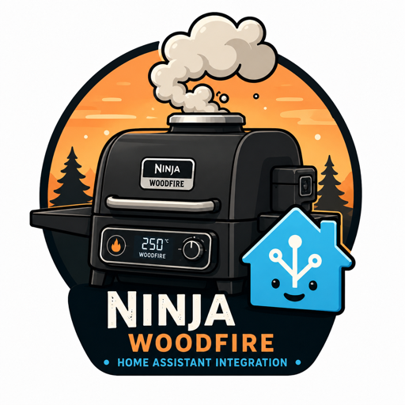

# HA Ninja Woodfire

[](https://github.com/hacs/integration)
[](LICENSE)



A local Home Assistant integration for the Ninja Woodfire Pro outdoor grill. It talks to the grill directly over Bluetooth Low Energy, so there's no cloud and no Ninja account involved.

**This is a work in progress.** BLE connectivity, the lid sensor and the connectivity sensor work today. The device protects its state and commands, and getting full read/write support working is the current focus — until it's done, most sensors won't report real values yet. See [ROADMAP.md](ROADMAP.md) for where things stand, and [docs/crypto-status.md](docs/crypto-status.md) for reverse-engineering progress on the encryption (the passive advertisement channel's crypto is now fully decoded; wiring it into the integration's sensors is the next step).

<br clear="left" />

## What works today

- A local BLE connection to the grill, with automatic reconnect.
- A **Connected** sensor that reflects the live BLE link.
- A **Lid** sensor (open/closed).
- A **Connection Enabled** switch that lets you hand the grill back to the Ninja mobile app (see below).

Everything else — temperatures, cook state, probes, timers — is wired up as entities but waits on the encryption work before it reports live data.

## Supported devices

Developed against a **Ninja Woodfire Pro Connect XL**. Other Woodfire models are likely compatible but haven't been tested. If you have one, captures and reports are welcome.

## Requirements

- Home Assistant Core 2026.6.0 or newer.
- A Bluetooth adapter reachable by HA (built-in or USB dongle).
- An ARM64 host (Raspberry Pi 4/5, HA Yellow, HA Green) is recommended. The integration will connect on x86_64, but full state support is only available on ARM64 for now.

## Installation

### HACS

1. HACS → Integrations → ⋮ → *Custom repositories*.
2. Add `https://github.com/PlukZelf/ha-ninja-woodfire` as an *Integration*.
3. Install **Ninja Woodfire** and restart Home Assistant.

### Manual

```bash
cp -r custom_components/ninja_woodfire /config/custom_components/
```

Then restart Home Assistant.

## Setup

1. Power on the grill and keep it nearby.
2. **Settings → Devices & Services → Add Integration**, search for **Ninja Woodfire**.
3. The grill is usually discovered over Bluetooth automatically. If not, enter its address manually.

## The Connection Enabled switch

Only one device can hold a BLE connection to the grill at a time, so Home Assistant and the Ninja mobile app can't both be connected. The **Connection Enabled** switch decides who gets it:

- **On** (default) — HA stays connected and reconnects automatically.
- **Off** — HA disconnects and stops trying, leaving the grill free for the Ninja app.

The choice survives a restart, so if you leave it off, HA won't grab the connection on the next boot.

## Entities

### Sensors

All of these are in place; the ones marked *pending* stay empty until state decryption is done.

| Entity | Description | |
|--------|-------------|--|
| `sensor.ninja_woodfire_state` | Idle / Preheating / Cooking / Complete / Error | pending |
| `sensor.ninja_woodfire_cook_mode` | Grill / Smoke / AirCrisp (Air Fry) / Roast / Bake / Broil / Dehydrate / MaxRoast / SlowCook | pending |
| `sensor.ninja_woodfire_grill_temperature` | Current grill temperature (°C) | pending |
| `sensor.ninja_woodfire_target_temperature` | Target temperature (°C) | pending |
| `sensor.ninja_woodfire_time_remaining` | Time remaining (s) | pending |
| `sensor.ninja_woodfire_cook_duration` | Total cook duration (s) | pending |
| `sensor.ninja_woodfire_cook_progress` | Cook progress (%) | pending |
| `sensor.ninja_woodfire_preheat_progress` | Preheat progress (%) | pending |
| `sensor.ninja_woodfire_probe_1_temperature` | Probe 1 temperature (°C) | pending |
| `sensor.ninja_woodfire_probe_1_target` | Probe 1 target (°C) | pending |
| `sensor.ninja_woodfire_probe_2_temperature` | Probe 2 temperature (°C) | pending |
| `sensor.ninja_woodfire_probe_2_target` | Probe 2 target (°C) | pending |

### Binary sensors

| Entity | Description | |
|--------|-------------|--|
| `binary_sensor.ninja_woodfire_connected` | Live BLE link | working |
| `binary_sensor.ninja_woodfire_lid` | Lid open/closed | working |
| `binary_sensor.ninja_woodfire_cooking` | Currently cooking | pending |
| `binary_sensor.ninja_woodfire_preheating` | Currently preheating | pending |
| `binary_sensor.ninja_woodfire_woodfire_active` | Woodfire/smoke active | pending |
| `binary_sensor.ninja_woodfire_probe_1_connected` | Probe 1 plugged in | pending |
| `binary_sensor.ninja_woodfire_probe_2_connected` | Probe 2 plugged in | pending |

### Switch

| Entity | Description |
|--------|-------------|
| `switch.ninja_woodfire_connection_enabled` | Hold or release the BLE connection (see above) |

### Controls

The control entities exist in Home Assistant already, but they don't send
anything to the grill yet: the write payload format isn't reverse-engineered,
so every command is deliberately blocked (it logs a warning instead of
transmitting) until the protocol is confirmed. See [ROADMAP.md](ROADMAP.md).

| Entity | Type | Description |
|--------|------|-------------|
| `select.ninja_woodfire_cook_function` | select | Grill / Smoke / AirCrisp (Air Fry) / Roast / Bake / Broil / Dehydrate / MaxRoast / SlowCook (defaults to Grill) |
| `select.ninja_woodfire_cook_type` | select | Probe (thermometer) vs. time-based |
| `number.ninja_woodfire_probe_1_target_temperature` | number | Probe 1 target (°C) — only for Probe cooks |
| `number.ninja_woodfire_probe_2_target_temperature` | number | Probe 2 target (°C) — only for Probe cooks |
| `time.ninja_woodfire_cook_time` | time | Cook time (HH:MM) — only for Timed cooks |
| `switch.ninja_woodfire_wood_flavor` | switch | Wood flavor / smoke on/off (default off) |
| `button.ninja_woodfire_start_cook` | button | Start the cook |
| `button.ninja_woodfire_stop_cook` | button | Stop the cook |

## Dashboard card

Home Assistant sorts entities on the device page alphabetically, so to lay the
controls out in a sensible order use an `entities` card:

```yaml
type: entities
title: Ninja Woodfire
entities:
  - entity: sensor.ninja_woodfire_state
  - entity: binary_sensor.ninja_woodfire_connected
  - type: divider
  - entity: select.ninja_woodfire_cook_function
  - entity: select.ninja_woodfire_cook_type
  - entity: switch.ninja_woodfire_wood_flavor
  - entity: time.ninja_woodfire_cook_time
  - entity: number.ninja_woodfire_probe_1_target_temperature
  - entity: number.ninja_woodfire_probe_2_target_temperature
  - type: divider
  - entity: button.ninja_woodfire_start_cook
  - entity: button.ninja_woodfire_stop_cook
  - type: divider
  - entity: switch.ninja_woodfire_connection_enabled
```

## Development

### Layout

```
custom_components/ninja_woodfire/   HA integration
  __init__.py                       Setup and teardown
  manifest.json                     Integration manifest
  config_flow.py                    Config flow (discovery + manual)
  coordinator.py                    Data update coordinator
  bluetooth.py                      BLE client
  protocol.py                       Protocol parser
  grillcore_native.py               Native library wrapper (future use)
  sensor.py / binary_sensor.py / switch.py   Entities
  diagnostics.py                    HA diagnostics
docs/                               Project notes
spec/gatt.md                        GATT services and characteristics
tools/                              BLE discovery and analysis scripts
captures/                           Local BLE captures (gitignored)
tests/                              Tests
```

`ARCHITECTURE.md` covers how the pieces fit together; `spec/gatt.md` has the protocol notes.

### Protocol status

The GATT layout and the BLE connection flow are documented. The device uses two separate BLE channels with unrelated encryption:

- **Advertisements** (no connection needed): fully decoded as of 2026-07-01 — see [docs/crypto-status.md](docs/crypto-status.md) for the crypto details and which fields are mapped (cook mode, temperatures, cook time, probe state). Not yet wired into the shipped sensors — it currently depends on a dev-only emulator tool, not something end users can install; a pure-Python port is planned.
- **GATT** (used for sending commands): still unsolved — its session key is negotiated fresh per connection and isn't derivable offline.

If you're working on this and want to compare notes, open an issue.

### Tests

```bash
pytest tests/ -v
```

## Contributing

Help is especially useful with:

- BLE captures in different states (cooking, preheating, various modes).
- Protocol analysis and documentation.
- Testing on other Ninja Woodfire models.

See [CONTRIBUTING.md](CONTRIBUTING.md) first. Changes are tracked in [CHANGELOG.md](CHANGELOG.md).

## Disclaimer

Unofficial and independent — not affiliated with or endorsed by SharkNinja. "Ninja" and "Woodfire" are trademarks of SharkNinja Operating LLC.

## License

MIT — see [LICENSE](LICENSE).
</content>
</invoke>
